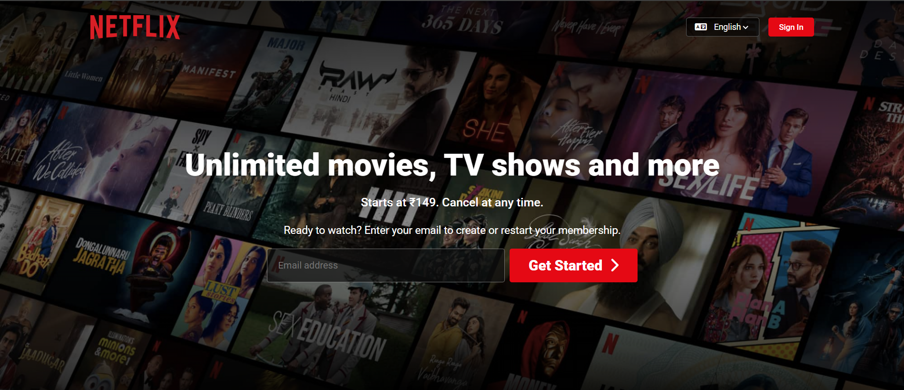
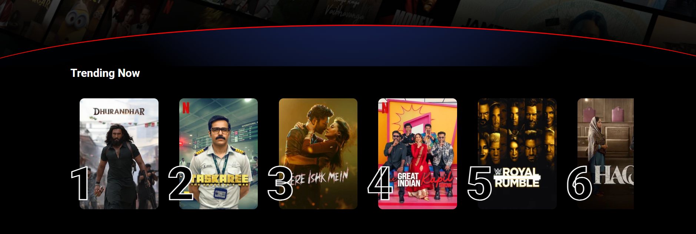
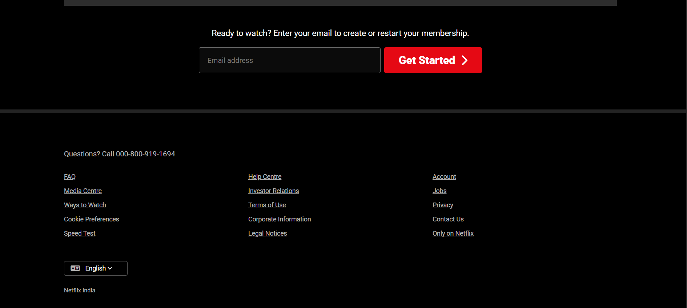
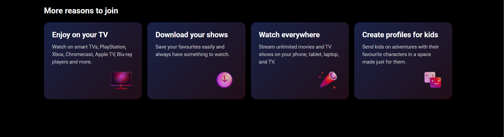

# 🎬 Netflix India - Landing Page Clone

## 📸 Screenshots

### Homepage



### Trending Section



### Footer Section



### extr-info Section



A pixel-perfect recreation of the Netflix India homepage. This project was built to master modern CSS layout techniques, complex positioning, and responsive design patterns without relying on CSS frameworks like Bootstrap or Tailwind.

## Repo Link

🔗 **https://github.com/skrm05/netflix-landing-page.git**

---

## 🎯 The Motive

Why clone Netflix? Because it is the gold standard for landing pages.
The goal of this assignment wasn't just to "make it look similar." It was to deeply understand **how** big tech companies structure their UI. I wanted to challenge myself with:

- **Complex Gradients:** Mastering the dark overlays that make text pop against background images.
- **The "Red Curve":** Replicating that iconic curved bottom edge without using SVG images.
- **Positioning:** Getting elements like the "Top 10" rank numbers to sit partially behind/over images.

---

## 🛠️ Tech Stack

- **HTML5:** Semantic structure for better SEO and accessibility.
- **CSS3:** Flexbox, CSS Grid, Custom Gradients, and Absolute Positioning.
- **FontAwesome:** For the scalable vector icons (search, chevron, plus signs).
- **Google Fonts:** Used 'Roboto' to match the clean, cinematic aesthetic.

---

## 🚀 Key Features & Approach

### 1. The Hero Section & Gradient Overlays

The header isn't just a simple background image. To ensure the white text is readable, I used a multi-layered CSS background approach:

```css
background:
  linear-gradient(rgba(0, 0, 0, 0.8), rgba(0, 0, 0, 0.3), ...), url(...);
```

### 2. The Tricky "Red Curve" 🔴

This was the most challenging part! Instead of using a simple image, I engineered it using pure CSS properties.

Technique: I created a div with a width larger than the screen (120%) and a border-radius of 60%.

The Glow: I added a radial-gradient and specific box-shadow to give it that subtle lighting effect that separates the hero section from the content below.

### 3. "Trending Now" Slider

Layout: Used display: flex with overflow-x: auto to create a smooth horizontal scroll for the movie cards.

The Numbers: The big rank numbers (1, 2, 3...) use -webkit-text-stroke to get that hollow outline effect. I positioned them absolutely to sit slightly outside the card, creating a 3D layered look.

### 4. Grid Layouts

For the "More Reasons to Join" section, I moved away from Flexbox and used CSS Grid. It made creating the 4-column layout responsive and perfectly aligned with minimal lines of code.

## 🧠 Challenges Faced

The Curve Alignment: Positioning the .red-curve so it sits exactly at the bottom of the hero section without creating horizontal scrollbars on the body was tricky. I had to strictly use overflow-x: hidden on the body to chop off the extra width.

Z-Index Wars: Managing the stacking context (z-index) between the hero image, the text, and the curve overlay took some trial and error to ensure the text remained selectable but the visual effect stayed on top.

## 📂 Project Structure

├── index.html # The main markup
├── style.css # All styling logic
└── images/ # Assets folder
├── header-image.png
├── logo.png
└── movie-posters
